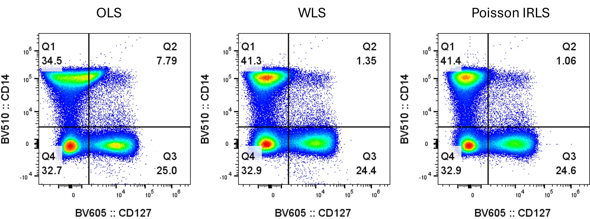

<!-- README.md is generated from README.Rmd. Please edit that file -->

```{r, include = FALSE}
knitr::opts_chunk$set(
  collapse = TRUE,
  comment = "#>",
  fig.path = "man/figures/README-",
  out.width = "100%"
)
```

# AutoSpectralRcpp

<!-- badges: start -->
<!-- badges: end -->

AutoSpectralRcpp provides a wrapper around a fast C++ function for performing
spectral unmixing of flow cytometry data using the Poisson-Hybrid approach. This
minimizes unmixing-dependent spread and spillover spread, producing better
resolution in most cases than OLS or WLS unmixing.



## Installation

Recommended, but not essential: first install AutoSpectral:

``` r
devtools::install_github("DrCytometer/AutoSpectral")
```

The AutoSpectralRcpp package optionally uses OpenMP for parallel processing. 
This is, unfortunately, quite difficult to set up on Mac. It should work 
automatically on Windows.
To enable it, define PKG_CXXFLAGS = -fopenmp in a personal ~/.R/Makevars file (Linux/macOS). You may need the following:

CXX_STD = CXX17
PKG_CXXFLAGS = -fopenmp
PKG_LIBS = -fopenmp $(LAPACK_LIBS) $(BLAS_LIBS) $(FLIBS)


You can install the development version of AutoSpectralRcpp like so:

``` r
devtools::install_github("DrCytometer/AutoSpectralRcpp")
```

## Example

Use the R wrapper function to unmix your data.

Raw data should be in the format of cells (rows) by detectors (columns), using 
only the fluorescence detectors. 

Spectra should be in the format of fluorophores (rows) by detectors (columns).
Detectors must match raw data. Fluorophore names should be set as the rownames
of spectra and should not appear in the matrix.

```{r, eval = FALSE}
library( AutoSpectralRcpp )
poisson.unmixed <- unmix.poisson.fast( raw.spectral.data, panel.spectra )
```

Spectra for unmixing can be generated using AutoSpectral, or extracted from 
other flow cytometry tools (e.g., FlowJo, FCSExpress).
