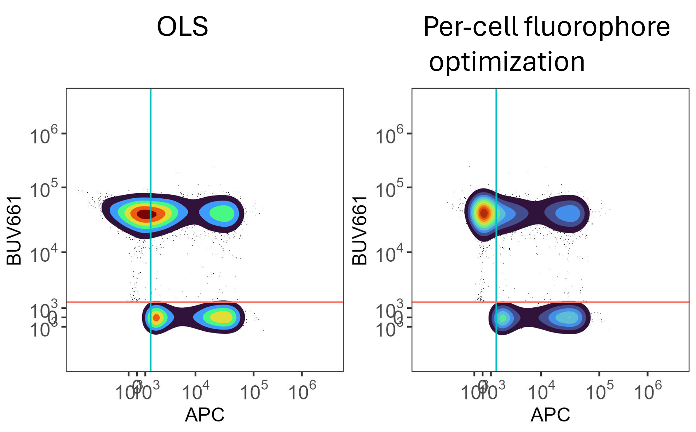

<!-- README.md is generated from README.Rmd. Please edit that file -->

```{r, include = FALSE}
knitr::opts_chunk$set(
  collapse = TRUE,
  comment = "#>",
  fig.path = "man/figures/README-",
  out.width = "100%"
)
```

# AutoSpectralRcpp

<!-- badges: start -->
<!-- badges: end -->

AutoSpectralRcpp provides a wrapper around fast C++ functions for performing
spectral unmixing of flow cytometry data using per-cell methods.




We also include a Poisson-Hybrid approach. This reduces unmixing-dependent 
spread and spillover spread somewhat, producing better resolution in most cases 
than OLS or WLS unmixing.


This work has received funding from the KU Leuven C1 program, the European 
Union’s Horizon 2020 research and innovation programme under grant agreement 
No 874707 (EXIMIOUS), Wellcome Investigator Award, 222442/A/21/Z and UKRI
Proactive Vaccinology Award, MR/Y004450/1 (IMMPROVE).

## Installation

Recommended, but not essential: first install AutoSpectral:

``` r
devtools::install_github("DrCytometer/AutoSpectral")
```
Also recommended, upgrade the BLAS and LAPACK libraries used by R. These
provide algorithms for linear algebra, which is the heart of spectral unmixing.
Simply swapping out your .dll files as in this tutorial can give speed ups of 5x.
[Install OpenBLAS](https://github.com/david-cortes/R-openblas-in-windows)

Do not set multiple threads for the BLAS as this will conflict with the higher
level OpenMP parallelization.

[More on fast BLAS](https://csantill.github.io/RPerformanceWBLAS/)

The AutoSpectralRcpp package optionally uses OpenMP for parallel processing. 
This is, unfortunately, quite difficult to set up on Mac. It should work 
automatically on Windows.
To enable it, define PKG_CXXFLAGS = -fopenmp in a personal ~/.R/Makevars file 
(Linux/macOS). You may need the following:

CXX_STD = CXX17
PKG_CXXFLAGS = -fopenmp
PKG_LIBS = -fopenmp $(LAPACK_LIBS) $(BLAS_LIBS) $(FLIBS)


You can install the development version of AutoSpectralRcpp like so:

``` r
devtools::install_github("DrCytometer/AutoSpectralRcpp")
```

## Example

Use the R wrapper function to unmix your data.

Raw data should be in the format of cells (rows) by detectors (columns), using 
only the fluorescence detectors. 

Spectra should be in the format of fluorophores (rows) by detectors (columns).
Detectors must match raw data. Fluorophore names should be set as the rownames
of spectra and should not appear in the matrix.

```{r, eval = FALSE}
library( AutoSpectralRcpp )
poisson.unmixed <- unmix.poisson.fast( raw.spectral.data, panel.spectra )
```

Spectra for unmixing can be generated using AutoSpectral, or extracted from 
other flow cytometry tools (e.g., FlowJo, FCSExpress).
