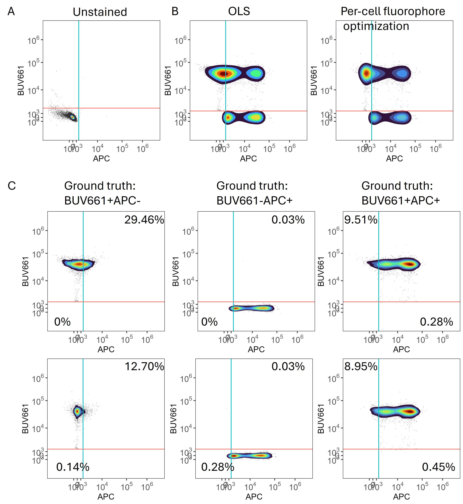

<!-- README.md is generated from README.Rmd. Please edit that file -->

```{r, include = FALSE}
knitr::opts_chunk$set(
  collapse = TRUE,
  comment = "#>",
  fig.path = "man/figures/README-",
  out.width = "100%"
)
```

# AutoSpectralRcpp

<!-- badges: start -->
<!-- badges: end -->

AutoSpectralRcpp provides a wrapper around fast C++ functions for performing
spectral unmixing of flow cytometry data using per-cell methods.


When unmixed using OLS in the context of the 42-colour panel containing APC and 
other red laser-excited dyes, the BUV661-stained cells exhibit variability with 
respect to red laser dyes, with the characteristic trumpet shape when viewed on 
a biexponential transformation. When the BUV661 spectrum is allowed to vary on a 
per-cell basis between the range of valid options available from the single-colour
control and a best fit per-cell is selected based on residual minimization, the
variability in APC values for BUV661+ events diminishes substantially. To demonstrate 
the effectiveness and accuracy of this approach, we created a set of synthetic
data. In this 42-colour data set, BUV661 and APC are used to detect CD19 and Foxp3,
markers that are not co-expressed. We created a set of data in silico where the raw
data for BUV661+ and APC+ events (based on OLS unmixing) were combined or maintained
as separate original events. In this way, ground truth is available for BUV661+, 
APC+ and BUV661+APC+ events. 

In A, we set the thresholds for positivity on the unstained sample (using the 99.5th
percentiles). In B, the whole synthetic data set is shown, unmixed using OLS or
with per-cell fluorophore optimization. In C, the data are split out into the 
known underlying ground truth populations, so we can measure the misclassification
rates based on the thresholds. When unmixed using OLS, populations containing BUV661
suffered from misclassification with respect to a positivity threshold for APC. 
These false positivity errors were reduced relative to OLS when per-cell spectral
selection was performed, and the median absolute deviation of ground truth BUV661+APC-
events in the APC channel was reduced from 2194 to 723.


We also include a Poisson-Hybrid approach (see [Novo et al., 2013](https://onlinelibrary.wiley.com/doi/10.1002/cyto.a.22272?msockid=306c486a53e568b31aa15b8752dd6961)). This reduces unmixing-dependent spread and spillover spread somewhat, producing better resolution in most cases than OLS or WLS unmixing. The Poisson-IRLS
approach is not part of the AutoSpectral workflow, just included for fun.


This work has received funding from the KU Leuven C1 program, the European 
Union’s Horizon 2020 research and innovation programme under grant agreement 
No 874707 (EXIMIOUS), Wellcome Investigator Award, 222442/A/21/Z and UKRI
Proactive Vaccinology Award, MR/Y004450/1 (IMMPROVE).

## Installation

Recommended, but not essential: first install AutoSpectral:

``` r
devtools::install_github("DrCytometer/AutoSpectral")
```
Also recommended, upgrade the BLAS and LAPACK libraries used by R. These
provide algorithms for linear algebra, which is the heart of spectral unmixing.
Simply swapping out your .dll files as in this tutorial can give speed ups of 5x.
[Install OpenBLAS](https://github.com/david-cortes/R-openblas-in-windows)

Do not set multiple threads for the BLAS as this will conflict with the higher
level OpenMP parallelization.

[More on fast BLAS](https://csantill.github.io/RPerformanceWBLAS/)

The AutoSpectralRcpp package optionally uses OpenMP for parallel processing. 
This is, unfortunately, quite difficult to set up on Mac. It should work 
automatically on Windows.
To enable it, define PKG_CXXFLAGS = -fopenmp in a personal ~/.R/Makevars file 
(Linux/macOS). You may need the following:

CXX_STD = CXX17
PKG_CXXFLAGS = -fopenmp
PKG_LIBS = -fopenmp $(LAPACK_LIBS) $(BLAS_LIBS) $(FLIBS)


You can install the development version of AutoSpectralRcpp like so:

``` r
devtools::install_github("DrCytometer/AutoSpectralRcpp")
```

## Example

Use the R wrapper function to unmix your data.

Raw data should be in the format of cells (rows) by detectors (columns), using 
only the fluorescence detectors. 

Spectra should be in the format of fluorophores (rows) by detectors (columns).
Detectors must match raw data. Fluorophore names should be set as the rownames
of spectra and should not appear in the matrix.

```{r, eval = FALSE}
library( AutoSpectralRcpp )
poisson.unmixed <- unmix.poisson.fast( raw.spectral.data, panel.spectra )
```

Spectra for unmixing can be generated using AutoSpectral, or extracted from 
other flow cytometry tools (e.g., FlowJo, FCSExpress).
